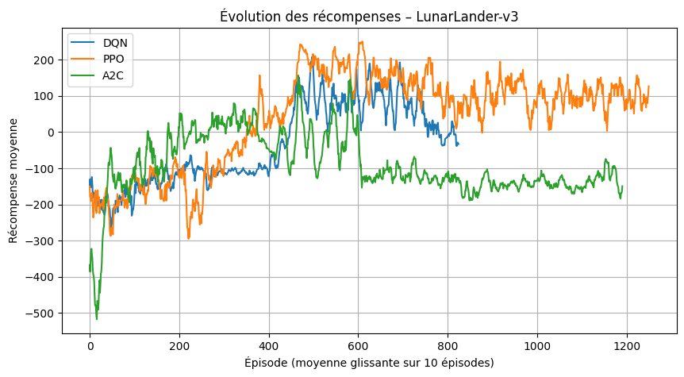
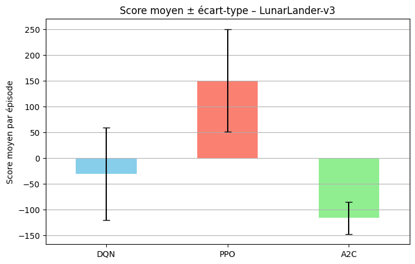

# Projet de Reinforcement Learning – LunarLander-v3 (discret)

## 1. Présentation générale

Ce projet avait pour objectif de mettre en pratique mes connaissances en Reinforcement Learning à travers l’environnement **LunarLander-v3**.  
Mon but était de comparer différents algorithmes RL, analyser leurs performances, leur stabilité et leur comportement dans un environnement à **actions discrètes**.

J’ai choisi LunarLander-v3 pour sa dynamique complexe et son système de récompense riche, ce qui permet d’observer comment différents agents apprennent à contrôler le module lunaire.

Lien vers la présentation : https://www.canva.com/design/DAG78DrMdbc/gtAIJIMnYRrE6kTtD6DMqg/edit?utm_content=DAG78DrMdbc&utm_campaign=designshare&utm_medium=link2&utm_source=sharebutton

---

## 2. Environnement : LunarLander-v3

### Description générale

LunarLander-v3 simule l’atterrissage d’un module spatial sur une surface lunaire.  
L’agent doit contrôler les moteurs du module afin d’atterrir entre deux drapeaux avec une vitesse et une orientation adaptées, tout en limitant la consommation de carburant.

Documentation officielle :  
https://gymnasium.farama.org/environments/box2d/lunar_lander/

---

### États (observations)

L’espace d’observation est un vecteur de **8 valeurs continues** :

1. Position horizontale du module  
2. Position verticale  
3. Vitesse horizontale  
4. Vitesse verticale  
5. Angle du module  
6. Vitesse angulaire  
7. Contact de la jambe gauche avec le sol (0 ou 1)  
8. Contact de la jambe droite avec le sol (0 ou 1)

---

### Actions

L’espace d’actions est **discret** :

- 0 : ne rien faire  
- 1 : activer le moteur gauche  
- 2 : activer le moteur principal  
- 3 : activer le moteur droit  

---

### Récompenses

La fonction de récompense encourage :

- une descente contrôlée,  
- un atterrissage stable entre les drapeaux,  
- une consommation de carburant modérée.  

Un atterrissage réussi donne une récompense positive, tandis qu’un crash entraîne une pénalité.

---

### Conditions de terminaison

Un épisode se termine lorsque :

- le module atterrit correctement,  
- le module s’écrase,  
- ou sort de la zone de jeu.

---

## 3. Algorithmes implémentés

J’ai testé trois algorithmes adaptés aux actions discrètes :

- **DQN (Deep Q-Network)** : approximation de la fonction de valeur Q par un réseau de neurones.  
- **PPO (Proximal Policy Optimization)** : policy gradient reconnu pour sa stabilité.  
- **A2C (Advantage Actor-Critic)** : algorithme actor-critic synchrone, rapide à entraîner.  

Ces choix m’ont permis de comparer différents types d’approches RL sur le même environnement.

---

## 4. Méthodologie expérimentale

Chaque algorithme a été entraîné sur le même environnement avec des paramètres comparables pour assurer une évaluation équitable.  
J’ai utilisé un **callback personnalisé** pour enregistrer la récompense totale à la fin de chaque épisode et mesurer la **stabilité de l’apprentissage**.

J’ai également chronométré chaque entraînement pour inclure le **temps d’exécution** dans l’analyse des performances.

---

## 5. Résultats comparatifs

Voici les résultats obtenus après entraînement et évaluation :

| Algorithme | mean_reward | std_reward | execution_time_sec |
|------------|------------|------------|------------------|
| DQN        | -30.72     | 89.57      | 631.64           |
| PPO        | 150.81     | 99.84      | 507.56           |
| A2C        | -116.09    | 31.33      | 643.12           |

- **mean_reward** : score moyen par épisode  
- **std_reward** : écart-type des récompenses  
- **execution_time_sec** : temps total d’entraînement en secondes  


*Courbe de récompense moyenne glissante sur 10 épisodes pour chaque algorithme.*


*Barplot comparant le score moyen et la stabilité (écart-type) des trois algorithmes.*

---

### Courbes et graphiques

- J’ai utilisé une **moyenne glissante sur 10 épisodes** pour lisser les courbes et faciliter la comparaison entre algorithmes.  
- Le barplot montre le score moyen ± écart-type pour une comparaison rapide et claire.  
- Un graphique supplémentaire peut illustrer le temps d’exécution pour chaque algorithme afin de visualiser le compromis performance / coût computationnel.

---

## 6. Analyse personnelle

- Les différences de nombre d’épisodes observées sur les courbes s’expliquent par la **durée variable des épisodes** : A2C termine souvent plus rapidement, PPO explore prudemment, DQN est intermédiaire.  
- PPO obtient le meilleur score moyen, tandis que DQN et A2C présentent plus de variations ou des scores négatifs.  
- L’ajout du chronométrage m’a permis de constater que PPO est non seulement performant mais aussi plus rapide à entraîner que DQN et A2C.  
- Les limites : les hyperparamètres utilisés sont ceux par défaut de Stable-Baselines3 et n’ont pas été optimisés spécifiquement pour l’environnement. De plus, chaque algorithme a été entraîné avec une seule seed, ce qui rend les résultats sensibles à l’aléatoire. Une étude plus approfondie impliquerait un réglage des hyperparamètres et une moyenne sur plusieurs seeds. Le nombre de timesteps est aussi limité par le temps disponible.

---

## 7. Outils et assistance IA

J’ai utilisé des outils d’IA pour m’aider à structurer le code et clarifier certains concepts, mais toutes les décisions et l’interprétation des résultats ont été faites par moi. L’IA n’a servi que comme outil d’assistance.

---

## 8. Instructions d’exécution

### Dépendances

```bash
pip install gymnasium[box2d] stable-baselines3 matplotlib pandas
